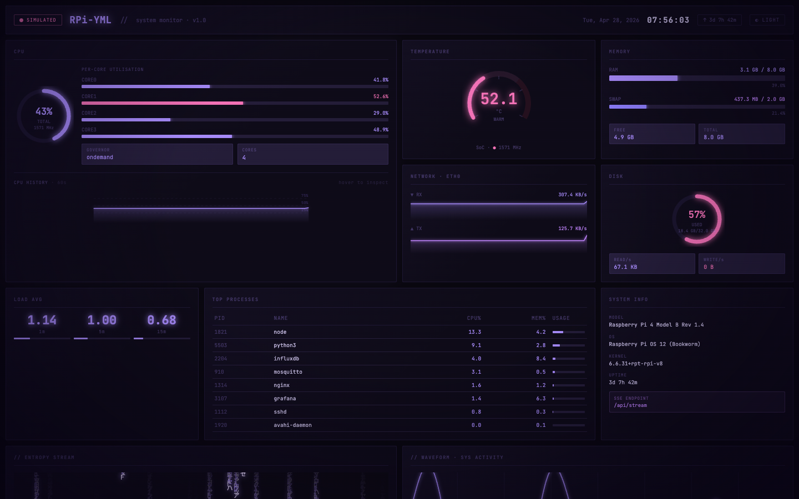
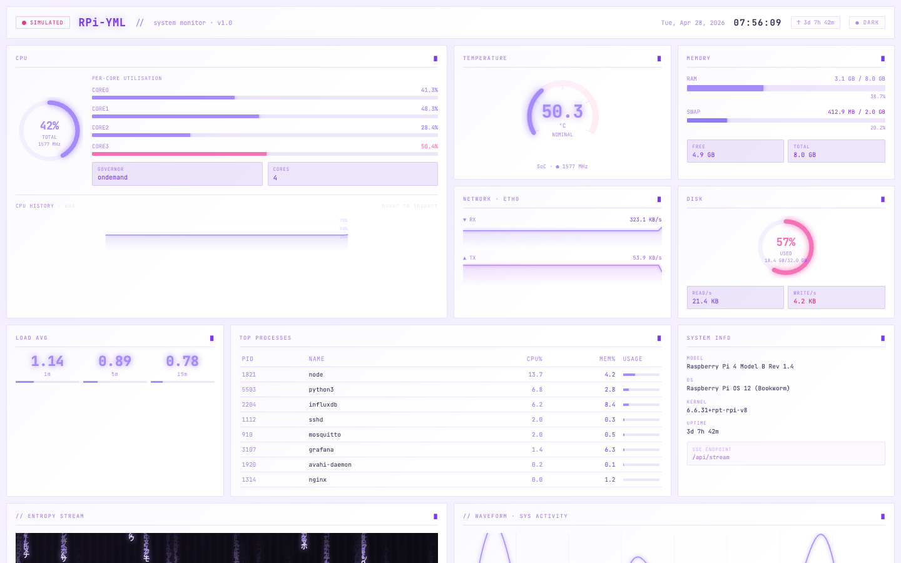
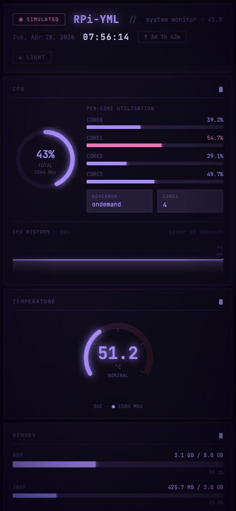

# RPi Monitor

Real-time system dashboard for Raspberry Pi. Hyprland/CLI aesthetic — deep purple palette, CRT scanlines, canvas animations, responsive bento grid layout.



---

## Features

- **11-card bento grid** — CPU, temperature, memory, disk, network, load average, processes, system info, matrix rain, oscilloscope
- **Live SSE stream** — Flask pushes a full stats payload every 2 seconds; no polling
- **Simulated fallback** — random-walk data kicks in automatically when the Pi is unreachable; the `SIMULATED` badge makes the source transparent
- **60-second interactive CPU history** — hover any point on the sparkline to inspect the value
- **Dark / light theme** — persisted to `localStorage`; scanlines and vignette disappear in light mode automatically
- **Responsive** — 4-col desktop → 2-col tablet → 1-col mobile

---

## Screenshots

| Dark mode | Light mode |
|---|---|
|  |  |

<div align="center">
  
  <p><em>Mobile (390 × 844)</em></p>
</div>

---

## Tech stack

| Layer | Tech |
|---|---|
| Frontend | React 19 · Vite 8 · TypeScript 6 |
| Styling | Plain CSS — custom properties, no framework |
| Canvas | Native 2D API (matrix rain + oscilloscope) |
| Backend | Python 3 · Flask · psutil |
| Transport | Server-Sent Events (`EventSource`) |

---

## Quick start

### Simulated mode (no Pi needed)

```bash
cd frontend
npm install
npm run dev          # http://localhost:5173
```

The dashboard opens in **SIMULATED** mode and runs with full animations using random-walk data.

### Live mode (Pi on the same network)

```bash
# On the Pi
pip install flask flask-cors psutil
python3 server/server.py          # listens on 0.0.0.0:5000

# On your dev machine — point Vite's proxy at the Pi's IP
# Edit frontend/vite.config.ts: target: 'http://<pi-ip>:5000'
cd frontend && npm run dev
```

---

## Project structure

```
raspi-monitor/
├── frontend/
│   └── src/
│       ├── components/       # One file per dashboard card
│       │   ├── canvas/       # MatrixCard, WaveformCard (2D canvas)
│       │   └── gauges/       # Ring and arc gauge primitives
│       ├── hooks/
│       │   ├── useStats.ts   # SSE connection + simulate fallback + ring buffer
│       │   └── useTheme.ts   # Dark/light toggle + localStorage persistence
│       ├── styles/
│       │   └── global.css    # All CSS vars (both themes), grid areas, shared styles
│       └── types.ts          # StatsPayload — must match server JSON shape
└── server/
    └── server.py             # Flask API: /api/stats (one-shot) + /api/stream (SSE)
```

---

## Dashboard cards

| Card | What it shows |
|---|---|
| **Header** | Hostname, live/simulated badge, real-time clock, uptime, theme toggle |
| **CPU** | Ring gauge (total %) + per-core bars + 60-second interactive history sparkline |
| **Temperature** | Arc gauge with NOMINAL / WARM / HOT zones (52 °C / 68 °C thresholds) |
| **Memory** | RAM + swap progress bars, free/total pills |
| **Network** | Dual RX / TX sparklines with live MB/s labels |
| **Disk** | Ring gauge + read/write bytes-per-second pills |
| **Load average** | 1m / 5m / 15m values with mini colour bars |
| **Top processes** | Table of 8 processes sorted by CPU%, live |
| **System info** | Pi model, OS, kernel, SSE endpoint URL |
| **Entropy stream** | Decorative matrix rain canvas |
| **Waveform** | Oscilloscope canvas; amplitude driven by CPU + network activity |

---

## API

The backend exposes two endpoints. Both return the same JSON shape.

```
GET /api/stats    one-shot JSON (useful for health checks / curl)
GET /api/stream   Server-Sent Events, pushes every 2 s
```

### Payload shape

```json
{
  "hostname": "RPi-YML",
  "model":    "Raspberry Pi 4 Model B Rev 1.4",
  "os":       "Linux 6.6.31+rpt-rpi-v8",
  "kernel":   "6.6.31+rpt-rpi-v8",
  "uptime":   12345,
  "cpu":      { "total": 41.2, "cores": [38, 55, 28, 47], "temp": 51.2, "freq": 1500, "governor": "ondemand" },
  "memory":   { "total": 8589934592, "used": 3327303475, "swap_total": 2147483648, "swap_used": 440401920 },
  "disk":     { "total": 34359738368, "used": 19751862149, "read_bps": 47104, "write_bps": 13312 },
  "network":  { "rx_bps": 268288, "tx_bps": 86016, "iface": "eth0" },
  "processes": [{ "pid": 1821, "name": "node", "cpu": 12.3, "mem": 4.2 }],
  "load":     [1.18, 0.92, 0.71]
}
```

---

## Deploying to Pi

### 1 — Backend

```bash
scp server/server.py pi@<pi-ip>:~/rpi-monitor/
ssh pi@<pi-ip>
pip install flask flask-cors psutil
python3 ~/rpi-monitor/server.py
```

### 2 — Frontend (production build)

```bash
cd frontend
npm run build        # outputs to frontend/dist/
scp -r dist/ pi@<pi-ip>:~/rpi-monitor/dist/
```

### 3 — Serve static files from Flask

Add to `server.py`:

```python
from pathlib import Path
from flask import send_from_directory

@app.route('/', defaults={'path': ''})
@app.route('/<path:path>')
def serve(path):
    if path and (Path('dist') / path).exists():
        return send_from_directory('dist', path)
    return send_from_directory('dist', 'index.html')
```

Then visit `http://<pi-ip>:5000`.

### 4 — Auto-start with systemd (optional)

Save as `/etc/systemd/system/rpi-monitor.service`:

```ini
[Unit]
Description=RPi Monitor
After=network.target

[Service]
ExecStart=/usr/bin/python3 /home/pi/rpi-monitor/server.py
WorkingDirectory=/home/pi/rpi-monitor
Restart=always
User=pi

[Install]
WantedBy=multi-user.target
```

```bash
sudo systemctl enable --now rpi-monitor
```

---

## Development

```bash
# Type check
cd frontend && npx tsc --noEmit

# Lint
cd frontend && npm run lint

# Production build (outputs to frontend/dist/)
cd frontend && npm run build
```

The Vite dev server proxies `/api/*` → `http://localhost:5000`, so the frontend and backend can run independently on the same machine during development.
